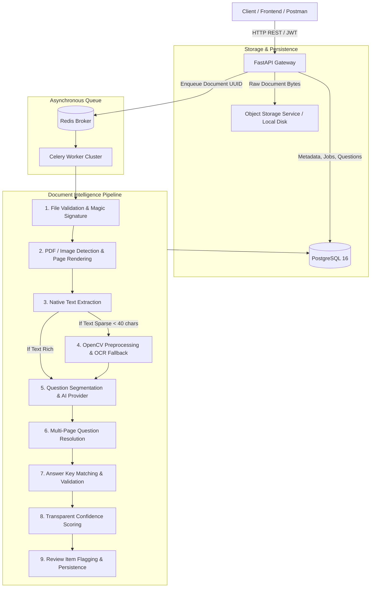
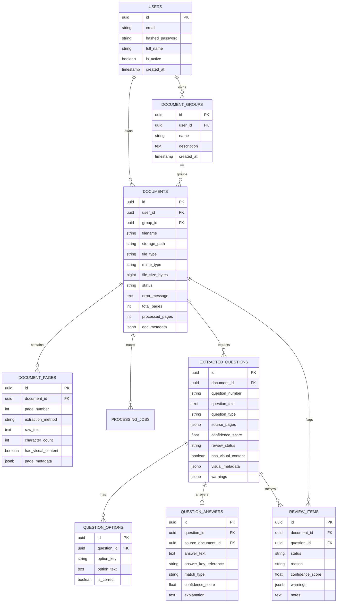

# System Architecture & Design Specification

## 1. Overview & High-Level Architecture

The **Document Intelligence & Question Extraction Service** is a production-grade, microservice-ready backend engineered to ingest examination documents, question banks, and answer keys in various formats (digital PDFs, scanned PDFs, PNG, JPG, JPEG), extract structured questions, preserve source page provenance, associate answer keys, resolve multi-page splits, compute transparent confidence scores, and flag uncertain items for human review.

---

## 2. Asynchronous Architecture & Lifecycle

As required by the assignment specification, document processing **never blocks the client upload request**.

### Request-Processing Lifecycle:
1. **Client Submission (`POST /api/v1/documents/upload`)**:
   - The API authenticates the user via JWT.
   - The file undergoes immediate validation: file size limit (50MB), extension check, MIME type check, and magic signature byte inspection.
   - The original file bytes are written to the storage abstraction under a non-guessable, sanitized key.
   - A `Document` record is inserted with `status = 'PENDING'` and `processed_pages = 0`.
   - The background task is enqueued to Celery via Redis (`process_document_task.delay(document_id)`).
   - The API returns **`HTTP 202 Accepted`** with the `document_id` in sub-second time.
2. **Background Execution**:
   - A Celery worker retrieves the task and updates document status to `PROCESSING`.
   - A `ProcessingJob` record tracks fine-grained execution stages: `INITIALIZING` -> `PAGE_PARSING` -> `QUESTION_EXTRACTION` -> `MULTIPAGE_RESOLUTION` -> `ANSWER_KEY_MATCHING` -> `CONFIDENCE_AND_REVIEW` -> `COMPLETED`.
   - Client applications monitor real-time progress percentage via `GET /api/v1/documents/{id}/status`.
3. **Completion & Review**:
   - On completion, document status transitions to `COMPLETED`, extracted questions and options are saved, and any question with confidence score below threshold (default 0.75) is placed in the `review_items` table.
   - If an unrecoverable failure occurs, the task retries with exponential backoff up to 3 times before setting `status = 'FAILED'` with a sanitized external error message.

---

## 3. Database Schema & Relational Design

The system implements a relational schema using **SQLAlchemy 2.0 Async** with asyncpg, managed via **Alembic migrations**:

---

## 4. Layered Document Processing Strategy

### Digital PDF vs. Scanned PDF / Image:
Rather than wastefully running expensive OCR on every digital PDF, the pipeline applies an intelligent tiered approach:
1. **Tier 1 (Native Digital Text)**:
   - Uses PyMuPDF (`fitz`) to extract raw character streams and detect font bounding boxes.
   - Evaluates text density: if extracted characters per page $\ge 40$, the page is processed as `native_text`.
2. **Tier 2 (OCR Fallback for Scanned Content)**:
   - If native text is below the character threshold (e.g. scanned image embedded in PDF or camera capture), the page is rendered at 150 DPI to a high-contrast bitmap.
   - The image is passed through OpenCV image preprocessing:
     - **Grayscale conversion**
     - **Deskewing**: MinAreaRect contour angle detection and affine rotation.
     - **Bilateral noise reduction**: Removes background noise while preserving character edges.
     - **Contrast enhancement (CLAHE)**: Normalizes uneven illumination.
   - Extracted using Tesseract OCR with per-word confidence aggregation.
   - Extraction provenance is stored in `DocumentPage.extraction_method = "ocr"`.

---

## 5. Question Segmentation & Multi-Page Resolution

### Numbering & Option Agnosticism:
The system parses question numbers without rigid formatting assumptions:
- Numeric: `1.`, `2.`, `17.`
- Prefixed: `Q1.`, `Q1:`, `Question 1:`, `Q. 1`
- Parenthesized: `1)`, `(1)`, `1:`
- Unnumbered: Detected based on interrogative sentence patterns (`Which of the following...`, `Explain why...`).

Supported options include `A.`, `(A)`, `(a)`, `a)`, `[A]`, `1.`, `1)`.

### Multi-Page Continuation Algorithm:
When questions span page boundaries (e.g. Question 17 starts on Page 4 with options A and B, and continues on Page 5 with options C and D):
1. The parser detects that Page 5 begins with orphan options (`C.`, `D.`) without an intervening question number.
2. The `MultipageResolver` links the orphan options with the immediately preceding question on Page 4.
3. The question's `source_pages` array is updated to `[4, 5]`.
4. Option lists and question text are concatenated while preserving provenance.

---

## 6. Answer Key Matching & Safety Philosophy

**Core Principle**: *Never hallucinate an answer. An uncertain answer is strictly preferable to an incorrect answer.*

Answer states are explicitly partitioned:
- **`matched`**: Found in question text or answer key table, verified against available MCQ options. Confidence: $\ge 0.90$.
- **`uncertain`**: Answer was indicated in key (e.g. 'E'), but question options only span 'A' through 'D'. Confidence: $\le 0.40$, flagged for review with warning `UNCERTAIN_ANSWER`.
- **`unmatched`**: Question number not found in supplied answer key.
- **`not_available`**: No answer key provided for document or document group.

### Related Documents (Document Groups):
When a question paper and an answer key are uploaded as separate documents (e.g., `QuestionPaper.pdf` and `AnswerKey.pdf`), associating them within a `DocumentGroup` enables the answer matcher to automatically search sibling documents in the group and match questions with answers, preserving the `source_document_id` of the answer key.

---

## 7. Transparent Confidence Scoring

Confidence is calculated using an explainable, deterministic scoring function:

$$\text{Confidence Score} = \text{Base} - \sum \text{Penalties}$$

### Parameters:
- **Base Score**:
  - `native_text`: $1.0$
  - `ocr`: Scaled by OCR average confidence score ($\ge 0.60$)
- **Penalties**:
  - Missing Question Number: $-0.20$ (`MISSING_QUESTION_NUMBER`)
  - Short Question Text ($<15$ characters): $-0.25$ (`SHORT_QUESTION_TEXT`)
  - MCQ with $<2$ options: $-0.30$ (`INCOMPLETE_OPTIONS`)
  - MCQ with only 2 or 3 options (non-True/False): $-0.05$
  - Multi-page spanning ambiguity: $-0.15$ (`MULTI_PAGE_AMBIGUITY`)
  - Uncertain answer / Option mismatch: $-0.15$ (`UNCERTAIN_ANSWER`)
  - Visual content requiring manual check: $-0.05$ (`VISUAL_CONTENT_DETECTED`)

If $\text{Confidence} < \text{Threshold}$ (default $0.75$), the question status is set to `PENDING_REVIEW` and a corresponding `ReviewItem` is added to the human review queue.

---

## 8. Security & Multi-Tenancy

- **Authentication**: Stateless HMAC-SHA256 JWT tokens with configurable expiration.
- **Strict Data Isolation**: Database queries enforce `Document.user_id == current_user.id` on every operation. Users cannot access, view, or modify other users' documents, questions, or reviews.
- **Path Traversal Prevention**: File storage paths are sanitized; storage keys are validated to ensure they never escape the designated storage root.
- **MIME & Magic Byte Verification**: Uploads must match allowed magic signatures for PDF, PNG, or JPEG.
